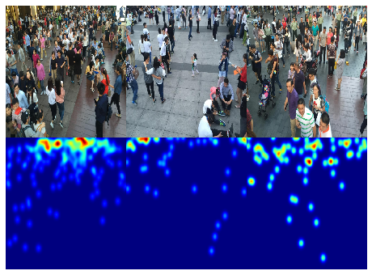
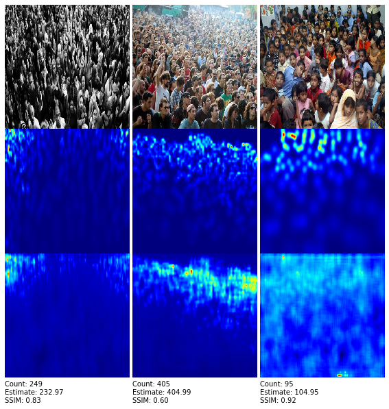

# Crowd estimation: CSRNet

**Update 08-06-2020:**
- Fixed broken link to dataset. I tried to upload the weights but they're too heavy for Github to handle. You can train the model and download it by just running the Colab notebook.

Train a Congested Scene Recognition network (CSRNet) using the methodology of [the paper](https://arxiv.org/pdf/1802.10062.pdf). This repo is an updated version from the other ones as it works on Python 3.7 and fixes some inconsistencies from the [original repo](https://github.com/leeyeehoo/CSRNet-pytorch).

If you wish to train the model from scratch, you can do so with the provided Colab notebook.

## Context

Estimating the number of people in a crowd has been an open area of research. There are a lot of applications that come in handy such as crowd monitoring, not neessarily for people, as it can also be used to calculate the number of bacteria in a sample, or the number of cars on a traffic jam.

There had been three approaches for tackling this challenge:
1. **Detection-based methods:** Train an object detector and then count the total number of detections. The problem here is that detectors perform poorly on congested scenes due to highly-occluded targets.
2. **Regression-based methods:** Train a regressor that takes as input an image and directly outputs the total number of objects. As mentioned by Li et al. [1], [saliency](https://analyticsindiamag.com/what-are-saliency-maps-in-deep-learning/) is overlooked, thus causing inaccurate results. 
3. **CNN-based methods:** Use fully Convolutional Neural Networks (fCNNs) that generate density maps not only used for counting, but also to model crowd distributions. This approach has outperformed the other ones, and the most popular structure is Multi-column Convolutional Neural Network (MCNN), introduced by Zhang et al. [2].

Li et al. [1] followed the approach of Zhang et al. [2] when it comes to generating an output density map such that its sum is equal to the total number of people, given an input image (see Figure 1). As opposed to the MCNN structure, they introduced a deeper fCNN model which yields state-of-the-art results on the ShanghaiTech, UCSD, WorldExpo'10, UCF_CC_50, and Trancos datasets.

|  |
| :--: |
| *Figure 1. Groundtruth samples. First row is the input image and second row is the resulting density map* |

## Datasets
For the moment only the ShanghaiTech dataset (both parts A and B) is available for training, but part of my future work is to support other datasets for training, validation and testing. Either way, here are the links for all of them.

- [x] ShanghaiTech: [Drive](https://drive.google.com/file/d/16dhJn7k4FWVwByRsQAEpl9lwjuV03jVI/view)
- [ ] UCSD: [Webpage](http://www.svcl.ucsd.edu/projects/peoplecnt/)
- [ ] WorldExpo'10: [Webpage](http://www.ee.cuhk.edu.hk/~xgwang/expo.html)
- [ ] UCF-CC-50: [Webpage](https://www.crcv.ucf.edu/data/ucf-cc-50/)
- [ ] Trancos: [Webpage](http://agamenon.tsc.uah.es/Personales/rlopez/data/trancos/)

## Training and data generation
Model training supports both GPU and CPU, the former being recommended. If you wish to train the model from sratch then you can use the provided Colab notebook or clone this repo, download a dataset (e.g. Shanghai dataset) and do:
```console
foo@bar:crowd_estimation$ mv path/to/dataset_folder Shanghai
foo@bar:crowd_estimation$ python make_dataset.py Shanghai/ Shanghai_A
foo@bar:crowd_estimation$ python train.py part_A/trainval.json part_A/test.json
foo@bar:crowd_estimation$ python validation.py path/to/model.pth.tar part_A/test.json
```
There are a couple of flags for training such as allowing data augmentation (-a True/False) and continue training a model (-p path/to/model.pth.tar).

## Experiments
After training the model for ~50 epochs these were the results (see Figure 2 to visually check the output of the model):

| Model | MAE | MSE | SSIM |
| ----- | --- | --- | ---- |
| Shanghai_A | 82.941 | 131.376 | 0.697 |
| Shanghai_B | 10.611 | 16.282 | 0.977 |

As we can see, metrics for part B are similar to those mentioned in the paper. Nonetheless, the model for part A still needs to continue training. I'll do that as soon as Colab lets me use its GPU instances again.

|  |
| :--: |
| *Figure 2. Outputs of a trained CSRNet on Shanghai part A. First row is input image, second row is groundtruth density map, and third row shows the outputs of the model* |

## Future Work
- [ ] Make training available for all datasets mentioned in the paper.
- [ ] Upload the trained models ready for downloading.

## Reference list
[1] Li, Y., Zhang, X., & Chen, D. (2018). Csrnet: Dilated convolutional neural networks for understanding the highly congested scenes. In Proceedings of the IEEE conference on computer vision and pattern recognition (pp. 1091-1100).

[2] Zhang, Y., Zhou, D., Chen, S., Gao, S., & Ma, Y. (2016). Single-image crowd counting via multi-column convolutional neural network. In Proceedings of the IEEE conference on computer vision and pattern recognition (pp. 589-597).
